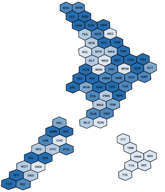
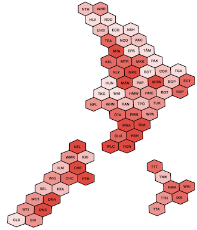
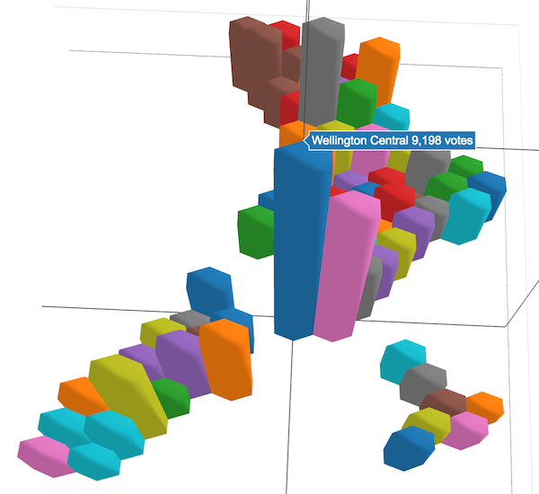
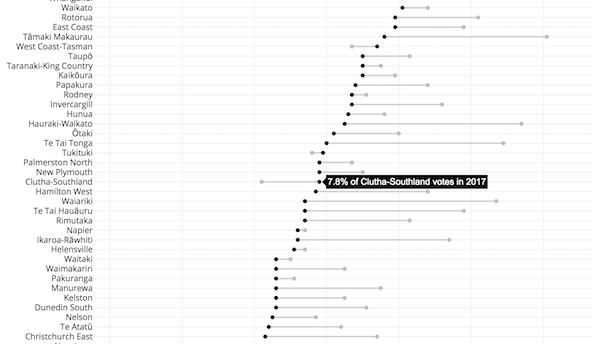
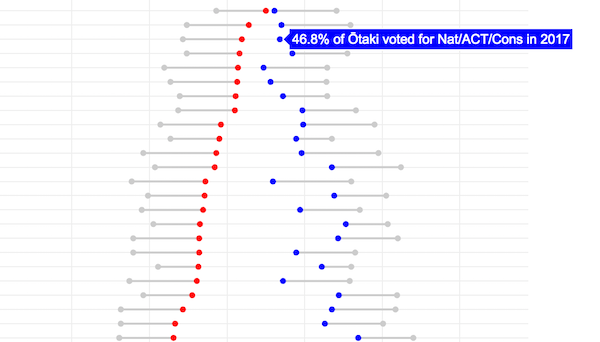

```{r init, include=FALSE}
knitr::opts_chunk$set(echo = FALSE)
knitr::opts_chunk$set(message = FALSE)
knitr::opts_chunk$set(warning = FALSE)
```

```{r setup, include=FALSE}
library(flexdashboard)
```

## 

### Welcome

We just had [an election](https://en.wikipedia.org/wiki/New_Zealand_general_election,_2017) in New Zealand, and try as I might I could not
resist trying to visualise some of the results. These are just what piqued my interest,
rather than an attempt to be complete or appeal to everyone. Hopefully others find them
interesting, if not useful.

Note that these pages are *desktop friendly*.
I wanted to make them mobile friendly, but whilst they don't "fail" as
such, they don't really succeed on a small screen. If you're like me you'll be
wanting to spend some time poking around with the mouse though, so it's probably
not a bad thing.

David Friggens, October 2017

### Hexmaps

<p>
<a href="hexmaps.html#national"></a>
<a href="hexmaps.html#labour"></a>
</p>

Geographical maps of results don't give a good representation of the spread of support
various parties have. So here are some cartograms with one tile per electorate. You can
see candidate race winners, vote concentration for all parties, and which electorates
favoured the incumbent coalition or not.

### 3D Hexmaps

<p><a href="3dhex.html"></a></p>

I wanted to go further than the five colour shades in the hexmaps, so made these
hexmap / 3d barchart hybrids. They do give a bit more, but are potentially difficult
to interpret. I'm just happy that I managed to make it work!
(Note the page is 2MB and might take a few seconds to load.)


## 

### Dumbbells

<p><a href="dumbbells.html#nz-first"></a></p>

We know which parties gain and lost votes since 2014, but the national number doesn't
tell the full story. Was there universal swing, or were there localised ups and
downs? These dumbbell plots help make it clear.

<p><a href="dumbbells.html#left-vs-right"></a></p>


<script>
  (function(i,s,o,g,r,a,m){i['GoogleAnalyticsObject']=r;i[r]=i[r]||function(){
  (i[r].q=i[r].q||[]).push(arguments)},i[r].l=1*new Date();a=s.createElement(o),
  m=s.getElementsByTagName(o)[0];a.async=1;a.src=g;m.parentNode.insertBefore(a,m)
  })(window,document,'script','https://www.google-analytics.com/analytics.js','ga');

  ga('create', 'UA-30013353-2', 'auto');
  ga('send', 'pageview');

</script>

